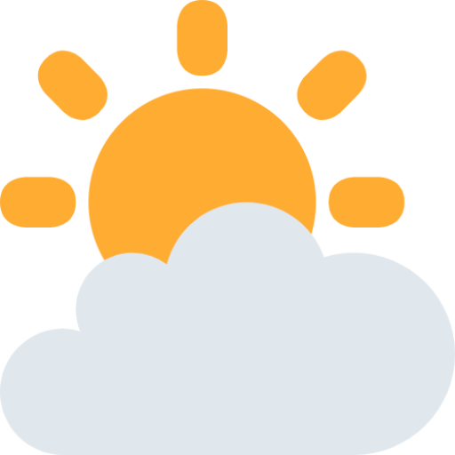
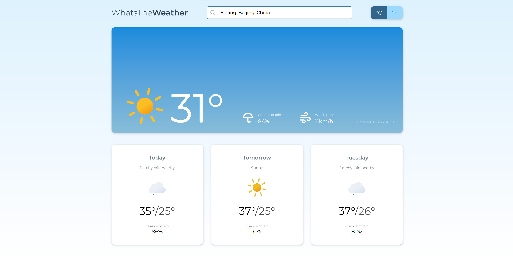

<!-- PROJECT SHIELDS -->

[![Issues][issues-shield]][issues-url]
[![MIT License][license-shield]][license-url]
[![LinkedIn][linkedin-shield]][linkedin-url]

<!-- PROJECT LOGO -->
 

  

<h3 align="center">WhatsThe<b>Weather</b></h3>

  

    Vanilla JavaScript web app to tell you the weather
     
     
    <a href="https://henrylin.io/whats-the-weather/">View demo</a>
    ·
    <a href="https://github.com/henrylin03/whats-the-weather/issues/new">Add issue</a>
  

<!-- ABOUT THE PROJECT -->

## About

Search any city across the world to view its weather conditions for now, today, tomorrow and the day after tomorrow.

WhatsTheWeather calls the [Weather API](https://www.weatherapi.com/)'s "Realtime", "Forecast" and "Search/Autocomplete" APIs.

### Built with

(<a href="#readme-top">back to top</a>)

<!-- CONTRIBUTING -->

## Contributing

If you have a suggestion that would make WhatsTheWeather better, please feel free to [add an issue](https://github.com/henrylin03/whats-the-weather/issues/new) and/or fork and create a pull request.

<!-- LICENSE -->

## License

Distributed under the MIT License. See `LICENSE.txt` for more information.

## Acknowledgements

- Weather information returned from calling [Weather API](https://www.weatherapi.com/)'s various APIs
- Wireframed using [draw.io](https://app.diagrams.net/)
- Weather condition icons by [Bas.dev](https://github.com/basmilius/weather-icons)
- Non-weather-condition icons from [Tabler](https://tabler.io/icons)
- [Convert CSV to JSON](https://www.convertcsv.com/csv-to-json.htm) to convert conditions_map.csv, which maps weather conditions to weather condition icons, to JSON format
- Colour palette suggestions by [Coolors](https://coolors.co/)
- The present README file was heavily influenced by the ["Best-README-Template"](https://github.com/othneildrew/Best-README-Template)
- Favicon was generated by [favicon.io](https://favicon.io)

(<a href="#readme-top">back to top</a>)

<!-- MARKDOWN LINKS & IMAGES -->

[issues-shield]: https://img.shields.io/github/issues/henrylin03/whats-the-weather.svg?style=for-the-badge
[issues-url]: https://github.com/henrylin03/whats-the-weather/issues
[license-shield]: https://img.shields.io/github/license/henrylin03/whats-the-weather.svg?style=for-the-badge
[license-url]: https://github.com/henrylin03/whats-the-weather/blob/main/LICENSE
[linkedin-shield]: https://img.shields.io/badge/-LinkedIn-black.svg?style=for-the-badge&logo=linkedin&colorB=555
[linkedin-url]: https://www.linkedin.com/in/henrylin03/
