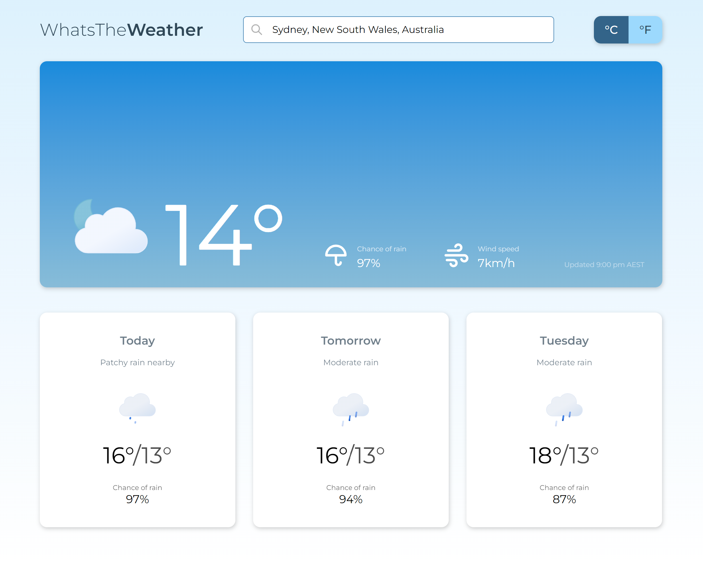

<!-- PROJECT SHIELDS -->

<!-- PROJECT LOGO -->
 

  

<h3 align="center">WhatsThe<b>Weather</b></h3>

  

    Vanilla JavaScript web app to tell you the weather
     
     
    <a href="https://henrylin.io/whats-the-weather/">View demo</a>
    ·
    <a href="https://github.com/henrylin03/whats-the-weather/issues/new">Add issue</a>
  

<!-- ABOUT THE PROJECT -->

<!-- CONTRIBUTING -->

<!-- LICENSE -->

## License

Distributed under the MIT License. See `LICENSE.txt` for more information.

(<a href="#readme-top">back to top</a>)

<!-- MARKDOWN LINKS & IMAGES -->
